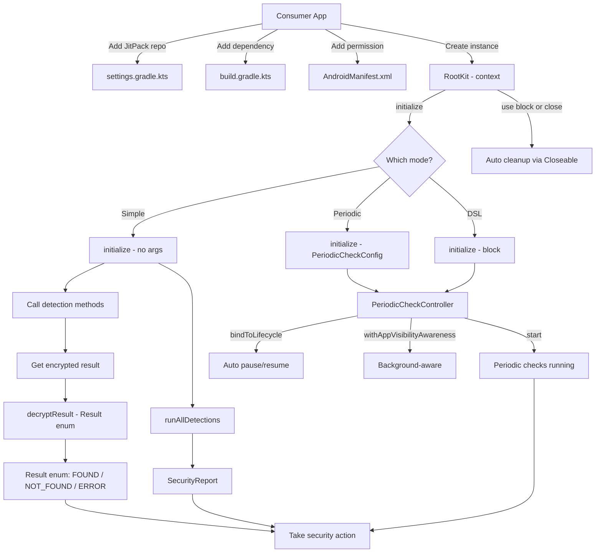

# Library Integration Plan: Third-Party App Integration for RootKit

> **ALL ITEMS COMPLETE** -- Every high, medium, and low priority item in this plan has been implemented. This document serves as a historical record of what was planned and delivered for the v1.0.0 release.

---

## 1. Current State Assessment

### What Works

- **Public API surface is well-defined**: [`RootKit`](rootkit/src/main/java/com/ssithara/rootkit/RootKit.kt) serves as the single entry point facade with clear method signatures
- **Result encryption**: All detection results are encrypted with AES-256-GCM per-instance session keys via [`EncryptionService`](rootkit/src/main/java/com/ssithara/rootkit/core/EncryptionService.kt) (internal)
- **Public decrypt API**: [`RootKit.decryptResult()`](rootkit/src/main/java/com/ssithara/rootkit/RootKit.kt:445) lets consumers decrypt results without implementing AES-GCM themselves
- **ProGuard rules**: Both [`proguard-rules.pro`](rootkit/proguard-rules.pro) and [`consumer-rules.pro`](rootkit/consumer-rules.pro) correctly preserve JNI names, public API, and periodic check types
- **Periodic monitoring API**: Full lifecycle-aware periodic check system with [`PeriodicCheckConfig`](rootkit/src/main/java/com/ssithara/rootkit/core/periodic/PeriodicCheckConfig.kt), [`PeriodicCheckController`](rootkit/src/main/java/com/ssithara/rootkit/core/periodic/PeriodicCheckController.kt), and DSL builder pattern
- **Maven publish**: Complete `maven-publish` block in [`build.gradle.kts`](rootkit/build.gradle.kts) with POM metadata, sources JAR, Javadoc JAR stub, and version centralization
- **JitPack config**: [`jitpack.yml`](jitpack.yml) correctly specifies `- openjdk21`
- **Closeable support**: [`RootKit`](rootkit/src/main/java/com/ssithara/rootkit/RootKit.kt:51) implements `Closeable` enabling Kotlin `use {}` blocks and Java try-with-resources
- **Dependency visibility**: `kotlinx.coroutines.android` and `androidx.lifecycle.process` declared as `api` in [`build.gradle.kts`](rootkit/build.gradle.kts:60)
- **Version centralization**: [`LIBRARY_VERSION=1.0.0`](gradle.properties:24) in `gradle.properties`, publishing block reads via `project.property("LIBRARY_VERSION")`
- **DetectionResult typealias**: [`Api.kt`](rootkit/src/main/java/com/ssithara/rootkit/Api.kt) provides `typealias DetectionResult = com.ssithara.rootkit.core.Result` for cleaner imports
- **RuntimeDetectionSummary typealias**: [`Api.kt`](rootkit/src/main/java/com/ssithara/rootkit/Api.kt) provides `typealias RuntimeDetectionSummary = RuntimeTamperingDetection.DetectionSummary` so consumers import from the root package
- **SecurityReport data class**: [`SecurityReport.kt`](rootkit/src/main/java/com/ssithara/rootkit/SecurityReport.kt) provides a typed report with `anyThreatFound()`, `toDecodedMap()`, and per-status convenience methods
- **runAllDetections() method**: Added to [`RootKit.kt`](rootkit/src/main/java/com/ssithara/rootkit/RootKit.kt) returning `SecurityReport` for one-call full security scan
- **Error handling pattern**: [`DetectorResult.runSafely()`](rootkit/src/main/java/com/ssithara/rootkit/core/DetectorResult.kt) catches all exceptions and returns `Result.ERROR`
- **Thread safety**: `AtomicBoolean`, `AtomicReference`, `WeakReference` patterns throughout
- **Java interop**: `@Keep`, `@JvmOverloads`, and `@JvmStatic` annotations on all public API types
- **KDoc**: Comprehensive KDoc on all public API types
- **Documentation**: README.md, CHANGELOG.md, MIGRATION.md, and app/README.md all created

### What Is Still Missing or Needs Improvement

All items have been completed. There are no remaining gaps for the v1.0.0 release.

---

## 2. Public API Review and Recommendations

### 2.1 Current Public API Surface

The library exposes these public types through [`RootKit.kt`](rootkit/src/main/java/com/ssithara/rootkit/RootKit.kt):

```
com.ssithara.rootkit.RootKit                    -- Facade (implements Closeable)
com.ssithara.rootkit.DetectionResult            -- Typealias for core.Result
com.ssithara.rootkit.RuntimeDetectionSummary    -- Typealias for RuntimeTamperingDetection.DetectionSummary
com.ssithara.rootkit.SecurityReport             -- Typed report for runAllDetections()
com.ssithara.rootkit.core.Result                -- Enum: FOUND, NOT_FOUND, ERROR
com.ssithara.rootkit.core.periodic.PeriodicCheckConfig
com.ssithara.rootkit.core.periodic.PeriodicCheckController
com.ssithara.rootkit.core.periodic.LifecycleAwarePeriodicCheck
com.ssithara.rootkit.core.periodic.AppVisibilityAwareCheck
```

### 2.2 API Issues

**DONE -- Issue 1: Encrypted return values with no public decrypt**

Resolved by adding [`RootKit.decryptResult()`](rootkit/src/main/java/com/ssithara/rootkit/RootKit.kt:445). Consumers can now call `rootKit.decryptResult(encryptedString)` to get a `Result` enum without implementing AES-GCM.

**DONE -- Issue 2: `Result` enum is in `core` package**

Resolved by adding [`typealias DetectionResult = com.ssithara.rootkit.core.Result`](rootkit/src/main/java/com/ssithara/rootkit/Api.kt:11) in the root package for cleaner imports.

**DONE -- Issue 3: `getRuntimeTamperingDetails()` returns raw `Map<String, Map<String, Any?>>`**

Resolved by adding [`SecurityReport`](rootkit/src/main/java/com/ssithara/rootkit/SecurityReport.kt) data class with typed fields and [`RootKit.runAllDetections()`](rootkit/src/main/java/com/ssithara/rootkit/RootKit.kt) returning `SecurityReport`. The report provides `anyThreatFound()`, `toDecodedMap()`, and per-status convenience methods (`rootStatus()`, `magiskStatus()`, etc.).

**DONE -- Issue 4: `DetectionSummary` is a nested type inside `RuntimeTamperingDetection`**

Resolved by adding [`typealias RuntimeDetectionSummary = RuntimeTamperingDetection.DetectionSummary`](rootkit/src/main/java/com/ssithara/rootkit/Api.kt) in the root package. `getRuntimeTamperingSummary()` now returns `RuntimeDetectionSummary?` so consumers import from the root package.

**DONE -- Issue 5: No `Closeable` / `AutoCloseable` on RootKit**

Resolved. [`RootKit`](rootkit/src/main/java/com/ssithara/rootkit/RootKit.kt:51) now implements `Closeable` with [`close()`](rootkit/src/main/java/com/ssithara/rootkit/RootKit.kt:263) delegating to `dispose()`.

### 2.3 Dependency Visibility

**DONE** -- Fixed in [`build.gradle.kts`](rootkit/build.gradle.kts):
```kotlin
api(libs.kotlinx.coroutines.android)      // periodic callbacks use coroutine types
api(libs.androidx.lifecycle.process)       // lifecycle types in public API
implementation(libs.rootbeer-lib)          // internal usage
implementation(libs.xposeddetector)        // prefab -- internal usage
```

---

## 3. Publishing Pipeline

### 3.1 JitPack (Current -- All Fixes Applied)

All JitPack blockers are resolved:

1. **DONE -- `jitpack.yml` fixed**: [`- openjdk21`](jitpack.yml:2) has correct spacing
2. **DONE -- POM metadata added**: [`build.gradle.kts`](rootkit/build.gradle.kts:82) includes description, URL, license, developer, SCM info
3. **DONE -- Sources JAR added**: [`sourcesJar`](rootkit/build.gradle.kts:64) task registered and wired to publication
4. **DONE -- Javadoc JAR stub**: Added `javadocJar` task to [`build.gradle.kts`](rootkit/build.gradle.kts) and wired to publication

### 3.2 Consumer Dependency Declaration

After fixes, consumers add:

```kotlin
// settings.gradle.kts
dependencyResolutionManagement {
    repositories {
        google()
        mavenCentral()
        maven { url = uri("https://jitpack.io") }
    }
}

// build.gradle.kts
dependencies {
    implementation("com.github.ssithara:rootkit:1.0.0")
    // OR if JitPack group is different:
    implementation("com.ssithara:rootkit:1.0.0")
}
```

### 3.3 Maven Central (Future Consideration)

JitPack is sufficient for initial distribution. Maven Central requires:
- Sonatype account and namespace verification
- GPG-signed artifacts
- Published sources and javadoc JARs
- Complete POM metadata

This can be a follow-up task.

---

## 4. Integration Guide Structure for Third-Party Apps

The integration guide should cover these scenarios in order of complexity:

### 4.1 Quick Start (5-Minute Integration)

```
1. Add JitPack repository
2. Add dependency
3. Add QUERY_ALL_PACKAGES permission to AndroidManifest.xml
4. Create RootKit instance, initialize, call detections
5. Decrypt results using rootKit.decryptResult()
6. Use use {} block for automatic cleanup
```

### 4.2 One-Shot Detection Pattern

For apps that check security at startup (simplified with `Closeable` and `decryptResult`):

```kotlin
RootKit(context).use { rootKit ->
    rootKit.initialize()
    val encrypted = rootKit.isRootedDevice()
    val result = rootKit.decryptResult(encrypted)
    if (result == Result.FOUND) {
        // Handle root detected
    }
}
// dispose() called automatically via Closeable
```

### 4.3 Full Security Report Pattern

For apps that want all detections in a single call:

```kotlin
RootKit(context).use { rootKit ->
    rootKit.initialize()
    val report = rootKit.runAllDetections()
    if (report.anyThreatFound()) {
        // Handle threats
    }
}
```

### 4.4 Periodic Monitoring Pattern

For apps that continuously monitor:

```kotlin
val config = PeriodicCheckConfig.Builder()
    .setInterval(30_000L)
    .monitorAllDetections()
    .setCallback(object : PeriodicCheckConfig.SecurityCallback {
        override fun onDetectionResult(type: DetectionType, result: DetectionResult) { ... }
        override fun onCheckCycleComplete(summary: SecuritySummary) { ... }
        override fun onError(type: DetectionType, error: Throwable) { ... }
    })
    .build()

val controller = rootKit.initialize(config)
controller.start()
```

### 4.5 Lifecycle-Aware Monitoring

```kotlin
val lifecycleCheck = rootKit.initialize(config)
    .bindToLifecycle(lifecycle)
// Auto-pauses/resumes with Activity lifecycle
```

### 4.6 App Visibility-Aware Monitoring

```kotlin
val controller = rootKit.initialize(config)
val visibilityCheck = controller.withAppVisibilityAwareness()
controller.start()
// Pauses when app backgrounds, resumes on foreground
```

### 4.7 Integration Checklist for Consumers

| Step | Action |
|------|--------|
| 1 | Add JitPack maven repo |
| 2 | Add `implementation` dependency |
| 3 | Add `QUERY_ALL_PACKAGES` permission to manifest |
| 4 | Create `RootKit(context)` instance |
| 5 | Call `initialize()` before detections |
| 6 | Call detection methods |
| 7 | Call `decryptResult()` to get `Result` enum |
| 8 | Use `use {}` block or call `dispose()` when done |
| 9 | Handle `UnsatisfiedLinkError` gracefully |
| 10 | Configure ProGuard if consumer uses minification |

---

## 5. Code Changes Needed

### 5.1 High Priority -- Unblock Third-Party Integration

#### 5.1.1 DONE -- Add public decrypt convenience method to RootKit

Added [`decryptResult()`](rootkit/src/main/java/com/ssithara/rootkit/RootKit.kt:445) method that decrypts encrypted result strings to `Result` enum values using the per-instance session key.

#### 5.1.2 DONE -- Fix dependency visibility in build.gradle.kts

Changed `implementation` to `api` for [`kotlinx.coroutines.android`](rootkit/build.gradle.kts:60) and [`androidx.lifecycle.process`](rootkit/build.gradle.kts:61) in `rootkit/build.gradle.kts`.

#### 5.1.3 DONE -- Fix jitpack.yml

Fixed [`jitpack.yml`](jitpack.yml) -- added missing space: `- openjdk21`.

#### 5.1.4 DONE -- Add POM metadata to maven-publish block

Added full POM metadata in [`build.gradle.kts`](rootkit/build.gradle.kts:82): name, description, URL, Apache 2.0 license, developer info, and SCM connection.

#### 5.1.5 DONE -- Add sources JAR

Registered [`sourcesJar`](rootkit/build.gradle.kts:64) task and wired it to the publication via `artifact(tasks["sourcesJar"])`.

#### 5.1.6 DONE -- Make RootKit implement Closeable

[`RootKit`](rootkit/src/main/java/com/ssithara/rootkit/RootKit.kt:51) now implements `Closeable` with [`close()`](rootkit/src/main/java/com/ssithara/rootkit/RootKit.kt:263) delegating to `dispose()`.

### 5.2 Medium Priority -- Developer Experience

#### 5.2.1 DONE -- Add typealiases for cleaner imports

Created [`Api.kt`](rootkit/src/main/java/com/ssithara/rootkit/Api.kt) with `typealias DetectionResult = com.ssithara.rootkit.core.Result` and `typealias RuntimeDetectionSummary = RuntimeTamperingDetection.DetectionSummary`.

#### 5.2.2 DONE -- Version centralization

Moved version to [`LIBRARY_VERSION=1.0.0`](gradle.properties:24) in `gradle.properties`. Publishing block reads it via `project.property("LIBRARY_VERSION")`.

#### 5.2.3 DONE -- Create a public `SecurityReport` data class

Created [`SecurityReport.kt`](rootkit/src/main/java/com/ssithara/rootkit/SecurityReport.kt) with typed report containing encrypted results, `anyThreatFound()`, `toDecodedMap()`, and per-status convenience methods (`rootStatus()`, `magiskStatus()`, `magiskHideStatus()`, `runtimeTamperingStatus()`, `emulatorStatus()`, `debuggerStatus()`).

#### 5.2.4 DONE -- Add `runAllDetections()` method to RootKit

Added `runAllDetections()` method to [`RootKit.kt`](rootkit/src/main/java/com/ssithara/rootkit/RootKit.kt) returning `SecurityReport` for a single-call full security scan.

#### 5.2.5 DONE -- Document QUERY_ALL_PACKAGES requirement

Documented in [`README.md`](README.md) with Google Play policy implications, when the permission is required, and opt-out instructions for consumers who do not need Magisk stub detection.

#### 5.2.6 DONE -- Move `DetectionSummary` to public API package

Added [`typealias RuntimeDetectionSummary`](rootkit/src/main/java/com/ssithara/rootkit/Api.kt) in the root package and updated [`getRuntimeTamperingSummary()`](rootkit/src/main/java/com/ssithara/rootkit/RootKit.kt) to return `RuntimeDetectionSummary?` so consumers do not need to import from `detection.runtime`.

### 5.3 Lower Priority -- Polish

#### 5.3.1 DONE -- Add `@Keep` annotations

Added `@Keep` annotations to ALL public API types: [`RootKit`](rootkit/src/main/java/com/ssithara/rootkit/RootKit.kt), [`Result`](rootkit/src/main/java/com/ssithara/rootkit/core/Result.kt) (enum + values), [`PeriodicCheckConfig`](rootkit/src/main/java/com/ssithara/rootkit/core/periodic/PeriodicCheckConfig.kt) (+ DetectionType, ExecutionMode, SecurityCallback, DetectionResult, SecuritySummary, ErrorHandler, Builder), [`PeriodicCheckController`](rootkit/src/main/java/com/ssithara/rootkit/core/periodic/PeriodicCheckController.kt), [`LifecycleAwarePeriodicCheck`](rootkit/src/main/java/com/ssithara/rootkit/core/periodic/LifecycleAwarePeriodicCheck.kt), [`AppVisibilityAwareCheck`](rootkit/src/main/java/com/ssithara/rootkit/core/periodic/AppVisibilityAwareCheck.kt) (+ VisibilityConfig), [`SecurityReport`](rootkit/src/main/java/com/ssithara/rootkit/SecurityReport.kt).

#### 5.3.2 DONE -- Add `@JvmOverloads`

Added `@JvmOverloads` to [`AppVisibilityAwareCheck`](rootkit/src/main/java/com/ssithara/rootkit/core/periodic/AppVisibilityAwareCheck.kt) constructor.

#### 5.3.3 DONE -- Add `@JvmStatic`

Added `@JvmStatic` to factory methods: [`AppVisibilityAwareCheck.create()`](rootkit/src/main/java/com/ssithara/rootkit/core/periodic/AppVisibilityAwareCheck.kt) (both overloads), [`LifecycleAwarePeriodicCheck.bind()`](rootkit/src/main/java/com/ssithara/rootkit/core/periodic/LifecycleAwarePeriodicCheck.kt).

#### 5.3.4 DONE -- Add Javadoc JAR stub

Added `javadocJar` task to [`build.gradle.kts`](rootkit/build.gradle.kts) and wired to publication for JitPack compatibility.

#### 5.3.5 DONE -- Add KDoc on all public API types

Comprehensive KDoc added to: [`RootKit`](rootkit/src/main/java/com/ssithara/rootkit/RootKit.kt) (class-level + `isRootedDevice()`, `isDebuggerDetected()`, `isEmulatorDevice()`), [`Result`](rootkit/src/main/java/com/ssithara/rootkit/core/Result.kt) (class + each enum value), [`PeriodicCheckConfig`](rootkit/src/main/java/com/ssithara/rootkit/core/periodic/PeriodicCheckConfig.kt) (all nested types), [`PeriodicCheckController`](rootkit/src/main/java/com/ssithara/rootkit/core/periodic/PeriodicCheckController.kt), [`LifecycleAwarePeriodicCheck`](rootkit/src/main/java/com/ssithara/rootkit/core/periodic/LifecycleAwarePeriodicCheck.kt), [`AppVisibilityAwareCheck`](rootkit/src/main/java/com/ssithara/rootkit/core/periodic/AppVisibilityAwareCheck.kt).

---

## 6. Documentation Plan

### 6.1 DONE -- README.md (Repo Root)

Created [`README.md`](README.md) at repo root with the following sections:
- Features list with detection categories
- Installation instructions (JitPack setup)
- Quick Start (5 lines of code)
- Usage examples: one-shot detection, full security report, periodic monitoring, lifecycle-aware monitoring, visibility-aware monitoring, DSL builder
- API reference table of all public methods
- Detection types table
- Permissions guide (QUERY_ALL_PACKAGES with Google Play policy implications)
- ProGuard configuration notes
- Troubleshooting section
- Architecture diagram
- License

### 6.2 DONE -- API Reference (KDoc)

Comprehensive KDoc added to all public types:
- [`RootKit`](rootkit/src/main/java/com/ssithara/rootkit/RootKit.kt) -- class-level and key public methods
- [`Result`](rootkit/src/main/java/com/ssithara/rootkit/core/Result.kt) -- enum class and each value
- [`DetectionResult`](rootkit/src/main/java/com/ssithara/rootkit/Api.kt) -- typealias documentation
- [`RuntimeDetectionSummary`](rootkit/src/main/java/com/ssithara/rootkit/Api.kt) -- typealias documentation
- [`SecurityReport`](rootkit/src/main/java/com/ssithara/rootkit/SecurityReport.kt) -- class and all methods
- [`PeriodicCheckConfig`](rootkit/src/main/java/com/ssithara/rootkit/core/periodic/PeriodicCheckConfig.kt) -- builder, detection types, execution modes, callback interfaces, error handler
- [`PeriodicCheckController`](rootkit/src/main/java/com/ssithara/rootkit/core/periodic/PeriodicCheckController.kt) -- all interface methods
- [`LifecycleAwarePeriodicCheck`](rootkit/src/main/java/com/ssithara/rootkit/core/periodic/LifecycleAwarePeriodicCheck.kt) -- factory methods, bind extension
- [`AppVisibilityAwareCheck`](rootkit/src/main/java/com/ssithara/rootkit/core/periodic/AppVisibilityAwareCheck.kt) -- visibility configs

### 6.3 DONE -- CHANGELOG.md (Repo Root)

Created [`CHANGELOG.md`](CHANGELOG.md) at repo root with v1.0.0 release notes following Keep a Changelog format, covering Added, Changed, and Security sections.

### 6.4 DONE -- Migration Guide (Repo Root)

Created [`MIGRATION.md`](MIGRATION.md) at repo root with versioning policy (SemVer) and deprecation policy template for future major versions.

### 6.5 DONE -- Sample App Documentation

Created [`app/README.md`](app/README.md) inside the `app/` module explaining demo app architecture, build commands, screen descriptions, and how it maps to real-world integration patterns.

---

## 7. Migration / Versioning Strategy

### 7.1 Semantic Versioning

Follow SemVer strictly:
- **Patch** (1.0.x): Bug fixes, detection signature updates, no API changes
- **Minor** (1.x.0): New detection methods, new public API, backward compatible
- **Major** (x.0.0): Breaking API changes

### 7.2 Version Management

```
gradle.properties   -> LIBRARY_VERSION=1.0.0 (DONE)
build.gradle.kts    -> references project.property("LIBRARY_VERSION") (DONE)
CHANGELOG.md        -> updated per release (DONE -- v1.0.0 entry created)
git tag             -> v1.0.0 per release (JitPack builds from tags) (pending first release)
```

### 7.3 Release Process

1. Update `LIBRARY_VERSION` in `gradle.properties`
2. Update `CHANGELOG.md` with new version section
3. Commit: `chore: release v1.x.x`
4. Tag: `git tag v1.x.x`
5. Push: `git push origin main --tags`
6. JitPack auto-builds from the tag

### 7.4 Branch Strategy

```
main          -> stable releases
develop       -> integration branch
feature/*     -> feature branches
hotfix/*      -> urgent patches
```

---

## 8. Integration Flow Diagram



---

## 9. Implementation Summary

### Completed Items

| Item | File | Description |
|------|------|-------------|
| Public decrypt API | [`RootKit.kt`](rootkit/src/main/java/com/ssithara/rootkit/RootKit.kt:445) | `decryptResult()` method for consumers |
| Closeable support | [`RootKit.kt`](rootkit/src/main/java/com/ssithara/rootkit/RootKit.kt:51) | Implements `Closeable`, `close()` delegates to `dispose()` |
| Dependency scope | [`build.gradle.kts`](rootkit/build.gradle.kts:60) | `api` for coroutines and lifecycle dependencies |
| POM metadata | [`build.gradle.kts`](rootkit/build.gradle.kts:82) | Description, URL, license, developer, SCM |
| Sources JAR | [`build.gradle.kts`](rootkit/build.gradle.kts:64) | Registered and wired to publication |
| Javadoc JAR stub | [`build.gradle.kts`](rootkit/build.gradle.kts) | Empty stub for JitPack compatibility |
| Version centralization | [`gradle.properties`](gradle.properties:24) | `LIBRARY_VERSION=1.0.0`, read by publishing block |
| jitpack.yml fix | [`jitpack.yml`](jitpack.yml:2) | Correct `- openjdk21` spacing |
| DetectionResult typealias | [`Api.kt`](rootkit/src/main/java/com/ssithara/rootkit/Api.kt:11) | `typealias DetectionResult = com.ssithara.rootkit.core.Result` |
| RuntimeDetectionSummary typealias | [`Api.kt`](rootkit/src/main/java/com/ssithara/rootkit/Api.kt) | `typealias RuntimeDetectionSummary = RuntimeTamperingDetection.DetectionSummary` |
| SecurityReport data class | [`SecurityReport.kt`](rootkit/src/main/java/com/ssithara/rootkit/SecurityReport.kt) | Typed report with `anyThreatFound()`, `toDecodedMap()`, per-status methods |
| runAllDetections method | [`RootKit.kt`](rootkit/src/main/java/com/ssithara/rootkit/RootKit.kt) | Returns `SecurityReport` for one-call full security scan |
| getRuntimeTamperingSummary update | [`RootKit.kt`](rootkit/src/main/java/com/ssithara/rootkit/RootKit.kt) | Returns `RuntimeDetectionSummary?` instead of raw nested type |
| QUERY_ALL_PACKAGES documentation | [`README.md`](README.md) | Permission requirements, Google Play policy, opt-out instructions |
| KDoc on public API | Multiple files | Comprehensive KDoc on RootKit, Result, PeriodicCheckConfig, PeriodicCheckController, LifecycleAwarePeriodicCheck, AppVisibilityAwareCheck |
| @Keep annotations | Multiple files | All public API types annotated: RootKit, Result, PeriodicCheckConfig, PeriodicCheckController, LifecycleAwarePeriodicCheck, AppVisibilityAwareCheck, SecurityReport |
| @JvmOverloads | [`AppVisibilityAwareCheck.kt`](rootkit/src/main/java/com/ssithara/rootkit/core/periodic/AppVisibilityAwareCheck.kt) | Added to constructor |
| @JvmStatic | [`AppVisibilityAwareCheck.kt`](rootkit/src/main/java/com/ssithara/rootkit/core/periodic/AppVisibilityAwareCheck.kt), [`LifecycleAwarePeriodicCheck.kt`](rootkit/src/main/java/com/ssithara/rootkit/core/periodic/LifecycleAwarePeriodicCheck.kt) | Added to factory methods |
| README.md | [`README.md`](README.md) | Full public-facing repo documentation with features, installation, usage, API reference, permissions, troubleshooting |
| CHANGELOG.md | [`CHANGELOG.md`](CHANGELOG.md) | v1.0.0 release notes in Keep a Changelog format |
| MIGRATION.md | [`MIGRATION.md`](MIGRATION.md) | Versioning policy and deprecation policy template |
| app/README.md | [`app/README.md`](app/README.md) | Demo app architecture, build commands, screen descriptions |

### Remaining Items

All items have been completed. There are no remaining items for the v1.0.0 release.
