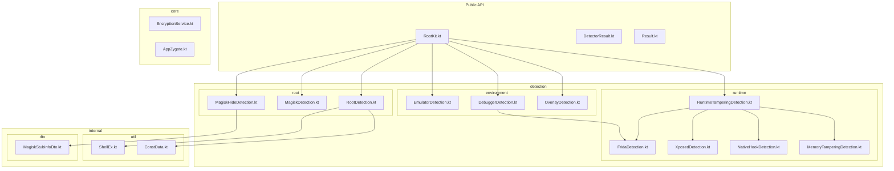
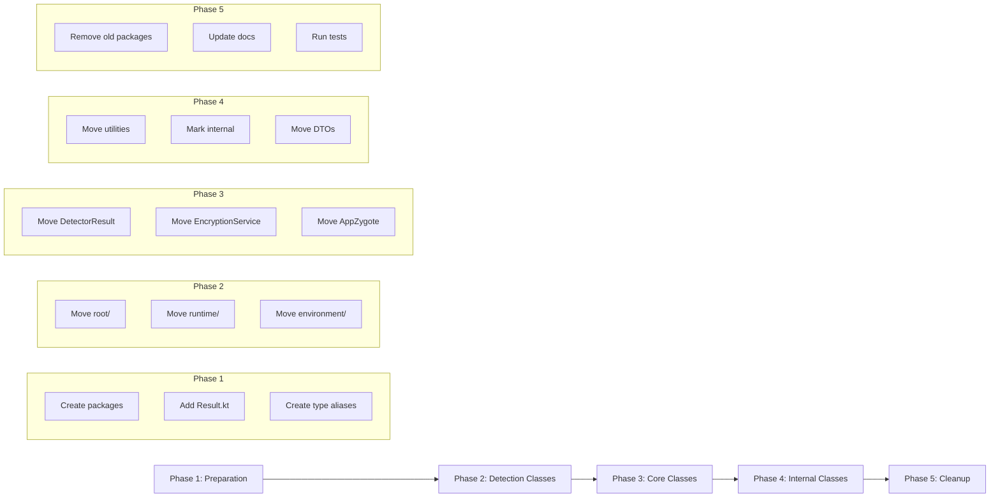

# RootKit Android Library - Modular Architecture Plan

## Executive Summary

This document outlines a clean modular architecture for the RootKit Android security library. The proposed structure improves code organization, maintainability, and discoverability while maintaining backward compatibility for the public API.

---

## 1. Current Structure Analysis

### Current Package Layout

```
com.ssithara.rootkit/
├── AppZygote.kt                    # Zygote preload
├── ConstData.kt                    # Constants
├── DebuggerDetection.kt            # Debugger detection
├── DetectorResult.kt               # Base class
├── EmulatorDetection.kt            # Emulator detection
├── EncryptionService.kt            # Encryption utility
├── MagiskDetection.kt              # Magisk detection (native)
├── MagiskHideDetection.kt          # MagiskHide stub detection
├── OverlayDetection.kt             # Overlay attack detection
├── RootDetection.kt                # Root detection (RootBeer)
├── RootKit.kt                      # Main facade
├── RuntimeTamperingDetection.kt    # Runtime tampering coordinator
├── ShellEx.kt                      # Shell execution utility
├── dto/
│   └── MagiskStubInfoDto.kt        # Data transfer object
├── frida/
│   └── FridaDetection.kt           # Frida detection
├── hooks/
│   └── NativeHookDetection.kt      # Native hook detection
├── memory/
│   └── MemoryTamperingDetection.kt # Memory tampering detection
└── xposed/
    └── XposedDetection.kt          # Xposed detection
```

### Current Issues

1. **Inconsistent organization** - Some detections are in subpackages while similar ones are at root level
2. **Mixed concerns** - Utilities, constants, and detection logic are intermixed
3. **Poor discoverability** - Related classes are scattered across the package
4. **No clear API boundary** - Public vs internal classes are not distinguished

---

## 2. Proposed Package Structure

### Package Diagram



### New Package Layout

```
com.ssithara.rootkit/
├── RootKit.kt                          # Public facade (stays at root)
│
├── core/                               # Core infrastructure
│   ├── DetectorResult.kt               # Abstract base class
│   ├── Result.kt                       # Result enum (extracted)
│   ├── EncryptionService.kt            # Encryption utility
│   └── AppZygote.kt                    # Zygote preload
│
├── detection/                          # All detection implementations
│   ├── root/                           # Root-related detections
│   │   ├── RootDetection.kt            # Root detection (RootBeer)
│   │   ├── MagiskDetection.kt          # Magisk native detection
│   │   └── MagiskHideDetection.kt      # MagiskHide stub detection
│   │
│   ├── runtime/                        # Runtime tampering detections
│   │   ├── RuntimeTamperingDetection.kt # Coordinator
│   │   ├── FridaDetection.kt           # Frida detection
│   │   ├── XposedDetection.kt          # Xposed detection
│   │   ├── NativeHookDetection.kt      # Native hook detection
│   │   └── MemoryTamperingDetection.kt # Memory tampering detection
│   │
│   └── environment/                    # Environment detections
│       ├── EmulatorDetection.kt        # Emulator detection
│       ├── DebuggerDetection.kt        # Debugger detection
│       └── OverlayDetection.kt         # Overlay attack detection
│
└── internal/                           # Internal utilities (not public API)
    ├── util/
    │   ├── ShellEx.kt                  # Shell execution utility
    │   └── ConstData.kt                # Constants and paths
    │
    └── dto/
        └── MagiskStubInfoDto.kt        # Data transfer objects
```

---

## 3. File Migration Mapping

### Files Moving to New Locations

| Current Location                     | New Location                                     | Notes                        |
| ------------------------------------ | ------------------------------------------------ | ---------------------------- |
| `DetectorResult.kt`                  | `core/DetectorResult.kt`                         | Base class for all detectors |
| `EncryptionService.kt`               | `core/EncryptionService.kt`                      | Core encryption service      |
| `AppZygote.kt`                       | `core/AppZygote.kt`                              | Native library loader        |
| `RootDetection.kt`                   | `detection/root/RootDetection.kt`                | Root detection               |
| `MagiskDetection.kt`                 | `detection/root/MagiskDetection.kt`              | Magisk detection             |
| `MagiskHideDetection.kt`             | `detection/root/MagiskHideDetection.kt`          | MagiskHide detection         |
| `RuntimeTamperingDetection.kt`       | `detection/runtime/RuntimeTamperingDetection.kt` | Runtime coordinator          |
| `frida/FridaDetection.kt`            | `detection/runtime/FridaDetection.kt`            | Move from frida/             |
| `xposed/XposedDetection.kt`          | `detection/runtime/XposedDetection.kt`           | Move from xposed/            |
| `hooks/NativeHookDetection.kt`       | `detection/runtime/NativeHookDetection.kt`       | Move from hooks/             |
| `memory/MemoryTamperingDetection.kt` | `detection/runtime/MemoryTamperingDetection.kt`  | Move from memory/            |
| `EmulatorDetection.kt`               | `detection/environment/EmulatorDetection.kt`     | Emulator detection           |
| `DebuggerDetection.kt`               | `detection/environment/DebuggerDetection.kt`     | Debugger detection           |
| `OverlayDetection.kt`                | `detection/environment/OverlayDetection.kt`      | Overlay detection            |
| `ShellEx.kt`                         | `internal/util/ShellEx.kt`                       | Internal utility             |
| `ConstData.kt`                       | `internal/util/ConstData.kt`                     | Internal constants           |
| `dto/MagiskStubInfoDto.kt`           | `internal/dto/MagiskStubInfoDto.kt`              | Internal DTO                 |

### Files Staying in Place

| File         | Location                       | Reason                      |
| ------------ | ------------------------------ | --------------------------- |
| `RootKit.kt` | `com.ssithara.rootkit.RootKit` | Main public API entry point |

---

## 4. Public API Considerations

### Public API Surface

The following classes should remain publicly accessible:

```kotlin
// Primary entry point - stays at root package
com.ssithara.rootkit.RootKit

// Core types needed by consumers
com.ssithara.rootkit.core.DetectorResult
com.ssithara.rootkit.core.Result

// Detection classes (if consumers need direct access)
com.ssithara.rootkit.detection.root.RootDetection
com.ssithara.rootkit.detection.root.MagiskDetection
com.ssithara.rootkit.detection.root.MagiskHideDetection
com.ssithara.rootkit.detection.runtime.RuntimeTamperingDetection
com.ssithara.rootkit.detection.runtime.FridaDetection
com.ssithara.rootkit.detection.runtime.XposedDetection
com.ssithara.rootkit.detection.runtime.NativeHookDetection
com.ssithara.rootkit.detection.runtime.MemoryTamperingDetection
com.ssithara.rootkit.detection.environment.EmulatorDetection
com.ssithara.rootkit.detection.environment.DebuggerDetection
com.ssithara.rootkit.detection.environment.OverlayDetection
```

### Internal API Surface

The following should be marked as `internal` visibility:

```kotlin
// Utilities - implementation details
com.ssithara.rootkit.internal.util.ShellEx
com.ssithara.rootkit.internal.util.ConstData

// DTOs - internal data structures
com.ssithara.rootkit.internal.dto.MagiskStubInfoDto
```

### Backward Compatibility Strategy

To maintain backward compatibility, use **type aliases** in the original locations:

```kotlin
// In original location: com/ssithara/rootkit/DetectorResult.kt
package com.ssithara.rootkit

// Type alias for backward compatibility
@Deprecated(
    message = "Use com.ssithara.rootkit.core.DetectorResult instead",
    replaceWith = ReplaceWith("DetectorResult", "com.ssithara.rootkit.core.DetectorResult")
)
typealias DetectorResult = com.ssithara.rootkit.core.DetectorResult
```

Apply similar type aliases for all moved public classes.

---

## 5. Benefits of the New Structure

### Improved Organization

| Benefit                    | Description                                                   |
| -------------------------- | ------------------------------------------------------------- |
| **Logical Grouping**       | Related detections are grouped together by category           |
| **Clear Separation**       | Core, detection, and utility code are clearly separated       |
| **Better Discoverability** | Developers can find related classes by package structure      |
| **Consistent Patterns**    | All detection implementations follow the same package pattern |

### Maintainability Improvements

| Benefit                | Description                                         |
| ---------------------- | --------------------------------------------------- |
| **Reduced Coupling**   | Internal utilities are hidden from public API       |
| **Easier Testing**     | Package structure allows for targeted unit tests    |
| **Clear Dependencies** | Import statements show clear dependency paths       |
| **Modular Growth**     | New detections can be added to appropriate packages |

### API Clarity

| Benefit                 | Description                                           |
| ----------------------- | ----------------------------------------------------- |
| **Explicit Public API** | Clear distinction between public and internal classes |
| **Deprecation Path**    | Type aliases allow gradual migration                  |
| **Documentation**       | Package structure serves as documentation             |
| **IDE Support**         | Better auto-complete suggestions                      |

---

## 6. Migration Strategy

### Phase 1: Preparation

1. Create new package structure
2. Add `Result.kt` enum to `core/` (extract from `DetectorResult.kt`)
3. Create type aliases in original locations

### Phase 2: Move Detection Classes

1. Move `root/` detection classes
2. Move `runtime/` detection classes (consolidate existing subpackages)
3. Move `environment/` detection classes
4. Update imports in `RootKit.kt`
5. Update type aliases

### Phase 3: Move Core Classes

1. Move `DetectorResult.kt` to `core/`
2. Move `EncryptionService.kt` to `core/`
3. Move `AppZygote.kt` to `core/`
4. Update type aliases

### Phase 4: Move Internal Classes

1. Create `internal/util/` package
2. Move `ShellEx.kt` and `ConstData.kt`
3. Mark as `internal` visibility
4. Create `internal/dto/` package
5. Move `MagiskStubInfoDto.kt`
6. Mark as `internal` visibility

### Phase 5: Cleanup

1. Remove empty old subpackages (`frida/`, `hooks/`, `memory/`, `xposed/`, `dto/`)
2. Update documentation
3. Update AGENTS.md with new structure
4. Run full test suite

### Migration Order Diagram



---

## 7. Additional Recommendations

### Result Enum Extraction

Extract the `Result` enum from `DetectorResult` into its own file:

```kotlin
// core/Result.kt
package com.ssithara.rootkit.core

enum class Result {
    NOT_FOUND,
    FOUND
}
```

This allows the enum to be used without requiring the abstract class dependency.

### DetectorResult Refactoring

Update `DetectorResult` to reference the extracted enum:

```kotlin
// core/DetectorResult.kt
package com.ssithara.rootkit.core

import android.content.Context

abstract class DetectorResult(protected val context: Context) {
    abstract fun run(): Result
}
```

### Internal Visibility

Mark utility classes with Kotlin's `internal` modifier:

```kotlin
// internal/util/ShellEx.kt
package com.ssithara.rootkit.internal.util

internal class ShellEx {
    // ...
}
```

### Native Code Organization

Consider organizing native C++ code to mirror the Kotlin structure:

```
cpp/src/
├── rootkit.cpp              # Main JNI entry
├── root/                    # Root detection native code
│   └── magisk_detection.cpp
├── runtime/                 # Runtime detection native code
│   ├── frida_detection.cpp
│   ├── xposed_detection.cpp
│   ├── native_hook_detection.cpp
│   └── memory_tampering_detection.cpp
```

---

## 8. Summary

This modular architecture plan provides:

1. **Clear package organization** by detection category
2. **Backward compatibility** through type aliases
3. **Internal API hiding** for implementation details
4. **Scalable structure** for future detection additions
5. **Phased migration** to minimize disruption

The new structure follows Android/Kotlin best practices and improves code discoverability, maintainability, and API clarity.
