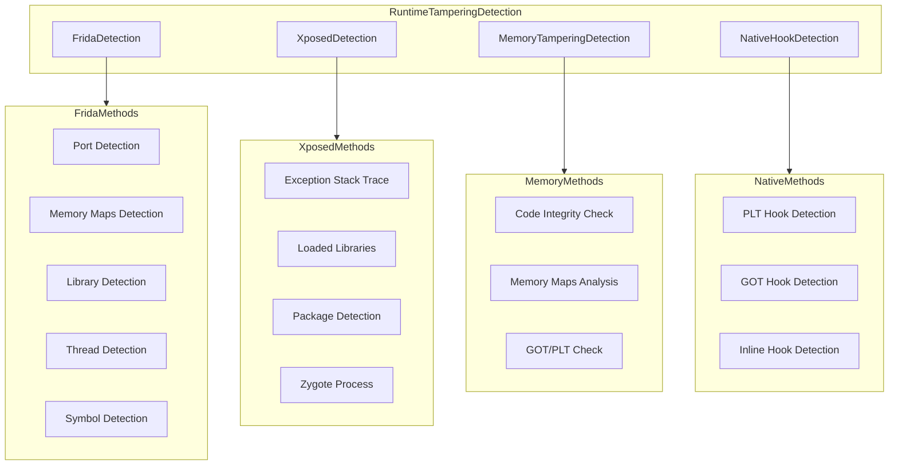

# Runtime Tampering Detection - Implementation Plan

## Overview

This plan outlines a comprehensive runtime tampering detection system for the RootKit Android security library. The solution will detect various forms of runtime manipulation including Frida instrumentation, Xposed hooking frameworks, memory tampering, and native code hooks.

## Current State Analysis

### Existing Implementation

- [`HookDetection.kt`](../rootkit/src/main/java/com/ssithara/rootkit/HookDetection.kt) - Minimal implementation with only Frida port check
- [`rootkit.cpp`](../rootkit/src/main/cpp/src/rootkit.cpp) - Native JNI with basic Frida port detection on port 27042
- Detection classes extend [`DetectorResult`](../rootkit/src/main/java/com/ssithara/rootkit/DetectorResult.kt) abstract class
- Results encrypted via [`EncryptionService`](../rootkit/src/main/java/com/ssithara/rootkit/EncryptionService.kt)

### Architecture Pattern

```
DetectorResult (abstract base)
    └── run(): Result (FOUND/NOT_FOUND)

RootKit (facade)
    └── Aggregates all detection methods
    └── Returns encrypted results
```

---

## Proposed Architecture

### Detection Layer Architecture



---

## Detailed Implementation Plan

### 1. Frida Detection Module

Frida can be detected through multiple vectors. A robust implementation should use several techniques:

#### 1.1 Port Detection - Native

- **Current**: Check port 27042 only
- **Enhancement**: Check multiple common Frida ports
- **Implementation**: Native JNI function

```cpp
// Ports to check: 27042, 27043, 27044, 27045
// Also check for frida-server default ports
```

#### 1.2 Memory Maps Detection - Native

- **Method**: Parse `/proc/self/maps` for Frida signatures
- **Signatures**: `frida-agent`, `frida-gadget`, `frida-server`, `linjector`
- **Implementation**: Native JNI function

```cpp
// Check /proc/self/maps for:
// - frida-agent-64.so
// - frida-gadget.so
// - linjector
// - frida-server
```

#### 1.3 Library Detection - Native

- **Method**: Check loaded libraries via `/proc/self/maps` or `dlopen`
- **Implementation**: Native JNI function

#### 1.4 Thread Detection - Native

- **Method**: Check for Frida-related thread names
- **Signatures**: `frida:rpc`, `frida:main`, `gmain`, `gum-js-loop`
- **Implementation**: Parse `/proc/self/task/[tid]/comm`

#### 1.5 Symbol Detection - Native

- **Method**: Check for hooked symbols in memory
- **Implementation**: Compare function prologues with expected values

### 2. Xposed Detection Module

#### 2.1 Exception Stack Trace Analysis - Kotlin

- **Method**: Throw exception and analyze stack trace for Xposed frames
- **Signatures**: `de.robv.android.xposed`, `io.github.lsposed`, `EdXposed`

#### 2.2 Loaded Libraries Check - Native

- **Method**: Check for Xposed libraries in memory
- **Signatures**: `libxposed_art.so`, `libedxposed.so`

#### 2.3 Package Detection - Kotlin

- **Method**: Check for installed Xposed packages
- **Packages**:
  - `de.robv.android.xposed.installer`
  - `io.github.lsposed.manager`
  - `org.lsposed.manager`
  - `com.sollyu.xposed.hook.model`

#### 2.4 Zygote Process Analysis - Native

- **Method**: Check for Xposed modifications in Zygote
- **Implementation**: Analyze `/proc/self/maps` for Xposed injection traces

### 3. Memory Tampering Detection Module

#### 3.1 Code Integrity Check - Native

- **Method**: Verify critical code sections match expected values
- **Implementation**: CRC32 or hash comparison of code segments

#### 3.2 Memory Maps Analysis - Native

- **Method**: Detect suspicious memory regions
- **Indicators**:
  - Anonymous executable memory regions
  - Unexpected writable+executable regions
  - Suspicious library loading paths

#### 3.3 GOT/PLT Integrity Check - Native

- **Method**: Verify GOT and PLT entries point to valid locations
- **Implementation**: Parse ELF structures and validate function pointers

### 4. Native Hook Detection Module

#### 4.1 PLT Hook Detection - Native

- **Method**: Check PLT entries for redirections
- **Implementation**: Compare PLT entries against known-good values

#### 4.2 GOT Hook Detection - Native

- **Method**: Verify GOT entries point within legitimate libraries
- **Implementation**: Parse GOT and validate address ranges

#### 4.3 Inline Hook Detection - Native

- **Method**: Check function prologues for JMP instructions
- **Implementation**: Analyze first bytes of critical functions

---

## File Structure

### New Kotlin Files

```
rootkit/src/main/java/com/ssithara/rootkit/
├── RuntimeTamperingDetection.kt    # Main facade for all tampering detection
├── frida/
│   └── FridaDetection.kt           # Frida detection coordinator
├── xposed/
│   └── XposedDetection.kt          # Xposed detection coordinator
├── memory/
│   └── MemoryTamperingDetection.kt # Memory tampering detection
└── hooks/
    └── NativeHookDetection.kt      # Native hook detection
```

### Native C++ Additions

```cpp
// Add to rootkit.cpp or create new files:

// Frida detection
jboolean detectFridaByPorts(JNIEnv* env);
jboolean detectFridaByMemoryMaps(JNIEnv* env);
jboolean detectFridaByThreads(JNIEnv* env);
jboolean detectFridaByLibraries(JNIEnv* env);

// Xposed detection
jboolean detectXposedByLibraries(JNIEnv* env);
jboolean detectXposedByMaps(JNIEnv* env);

// Memory tampering
jboolean detectMemoryTampering(JNIEnv* env);
jboolean checkCodeIntegrity(JNIEnv* env);
jboolean detectSuspiciousMemoryRegions(JNIEnv* env);

// Hook detection
jboolean detectPLTHooks(JNIEnv* env);
jboolean detectGOTHooks(JNIEnv* env);
jboolean detectInlineHooks(JNIEnv* env);
```

---

## Implementation Details

### FridaDetection.kt

```kotlin
class FridaDetection(context: Context) : DetectorResult(context) {

    companion object {
        @JvmStatic external fun detectByPorts(): Boolean
        @JvmStatic external fun detectByMemoryMaps(): Boolean
        @JvmStatic external fun detectByThreads(): Boolean
        @JvmStatic external fun detectByLibraries(): Boolean
    }

    override fun run(): Result {
        val detections = listOf(
            detectByPorts(),
            detectByMemoryMaps(),
            detectByThreads(),
            detectByLibraries()
        )

        return if (detections.any { it }) Result.FOUND else Result.NOT_FOUND
    }
}
```

### XposedDetection.kt

```kotlin
class XposedDetection(context: Context) : DetectorResult(context) {

    companion object {
        @JvmStatic external fun detectByLibraries(): Boolean
        @JvmStatic external fun detectByMaps(): Boolean
    }

    override fun run(): Result {
        // Check stack trace (Kotlin)
        if (checkStackTrace()) return Result.FOUND

        // Check installed packages (Kotlin)
        if (checkInstalledPackages()) return Result.FOUND

        // Native checks
        if (detectByLibraries()) return Result.FOUND
        if (detectByMaps()) return Result.FOUND

        return Result.NOT_FOUND
    }

    private fun checkStackTrace(): Boolean {
        return try {
            throw Exception("Xposed check")
        } catch (e: Exception) {
            e.stackTrace.any {
                it.className.contains("xposed", ignoreCase = true) ||
                it.className.contains("lsposed", ignoreCase = true) ||
                it.className.contains("edxposed", ignoreCase = true)
            }
        }
    }

    private fun checkInstalledPackages(): Boolean {
        val xposedPackages = listOf(
            "de.robv.android.xposed.installer",
            "io.github.lsposed.manager",
            "org.lsposed.manager"
        )

        return try {
            val pm = context.packageManager
            xposedPackages.any { pkg ->
                runCatching { pm.getPackageInfo(pkg, 0) }.isSuccess
            }
        } catch (e: Exception) {
            false
        }
    }
}
```

### MemoryTamperingDetection.kt

```kotlin
class MemoryTamperingDetection(context: Context) : DetectorResult(context) {

    companion object {
        @JvmStatic external fun detectSuspiciousRegions(): Boolean
        @JvmStatic external fun checkCodeIntegrity(): Boolean
        @JvmStatic external fun detectAnonymousExecMemory(): Boolean
    }

    override fun run(): Result {
        val detections = listOf(
            detectSuspiciousRegions(),
            checkCodeIntegrity(),
            detectAnonymousExecMemory()
        )

        return if (detections.any { it }) Result.FOUND else Result.NOT_FOUND
    }
}
```

### NativeHookDetection.kt

```kotlin
class NativeHookDetection(context: Context) : DetectorResult(context) {

    companion object {
        @JvmStatic external fun detectPLTHooks(): Boolean
        @JvmStatic external fun detectGOTHooks(): Boolean
        @JvmStatic external fun detectInlineHooks(): Boolean
    }

    override fun run(): Result {
        val detections = listOf(
            detectPLTHooks(),
            detectGOTHooks(),
            detectInlineHooks()
        )

        return if (detections.any { it }) Result.FOUND else Result.NOT_FOUND
    }
}
```

---

## Native Implementation Strategy

### Frida Detection - Memory Maps

```cpp
bool detect_frida_by_memory_maps() {
    FILE* fp = fopen("/proc/self/maps", "r");
    if (!fp) return false;

    char line[512];
    const char* frida_signatures[] = {
        "frida-agent",
        "frida-gadget",
        "frida-server",
        "linjector",
        "re.frida.server"
    };

    while (fgets(line, sizeof(line), fp)) {
        for (const auto& sig : frida_signatures) {
            if (strstr(line, sig) != nullptr) {
                fclose(fp);
                return true;
            }
        }
    }

    fclose(fp);
    return false;
}
```

### Frida Detection - Threads

```cpp
bool detect_frida_by_threads() {
    DIR* task_dir = opendir("/proc/self/task");
    if (!task_dir) return false;

    struct dirent* entry;
    const char* frida_threads[] = {
        "frida:rpc",
        "frida:main",
        "gmain",
        "gum-js-loop",
        "gum-js-engine"
    };

    while ((entry = readdir(task_dir)) != nullptr) {
        char comm_path[256];
        snprintf(comm_path, sizeof(comm_path),
                 "/proc/self/task/%s/comm", entry->d_name);

        FILE* comm_file = fopen(comm_path, "r");
        if (comm_file) {
            char comm[256];
            if (fgets(comm, sizeof(comm), comm_file)) {
                for (const auto& sig : frida_threads) {
                    if (strstr(comm, sig) != nullptr) {
                        fclose(comm_file);
                        closedir(task_dir);
                        return true;
                    }
                }
            }
            fclose(comm_file);
        }
    }

    closedir(task_dir);
    return false;
}
```

### GOT Hook Detection

```cpp
#include <link.h>
#include <elf.h>

bool detect_got_hooks() {
    // Get base address of our library
    void* base_addr = nullptr;

    FILE* maps = fopen("/proc/self/maps", "r");
    if (!maps) return false;

    char line[512];
    while (fgets(line, sizeof(line), maps)) {
        if (strstr(line, "librootkit.so")) {
            unsigned long addr;
            sscanf(line, "%lx-", &addr);
            base_addr = (void*)addr;
            break;
        }
    }
    fclose(maps);

    if (!base_addr) return false;

    // Parse ELF and check GOT entries
    // This is simplified - full implementation would parse
    // dynamic linking information

    return false; // Implement full ELF parsing
}
```

### Inline Hook Detection

```cpp
bool detect_inline_hooks(void* func_addr) {
    if (!func_addr) return false;

    // Common hook patterns
    unsigned char* bytes = (unsigned char*)func_addr;

    // Check for JMP instruction (0xE9 or 0xFF 0x25)
    if (bytes[0] == 0xE9 ||
        (bytes[0] == 0xFF && bytes[1] == 0x25)) {
        return true;
    }

    // Check for BR instruction on ARM64
    // 0xD61F0000 = BR X0
    uint32_t* arm_bytes = (uint32_t*)func_addr;
    if ((*arm_bytes & 0xFFFFFC1F) == 0xD61F0000) {
        return true;
    }

    return false;
}
```

---

## Integration with RootKit Facade

### Updated RootKit.kt

```kotlin
class RootKit(private val context: Context) {
    // ... existing properties ...

    private val fridaDetection by lazy { FridaDetection(context) }
    private val xposedDetection by lazy { XposedDetection(context) }
    private val memoryTamperingDetection by lazy { MemoryTamperingDetection(context) }
    private val nativeHookDetection by lazy { NativeHookDetection(context) }

    // ... existing methods ...

    fun isRuntimeTamperingDetected(): String {
        val detections = listOf(
            fridaDetection.run(),
            xposedDetection.run(),
            memoryTamperingDetection.run(),
            nativeHookDetection.run()
        )

        val result = if (DetectorResult.Result.FOUND in detections)
            DetectorResult.Result.FOUND
        else
            DetectorResult.Result.NOT_FOUND

        return EncryptionService.encryptWithBase64Key(result.name)
    }

    // Individual detection methods
    fun isFridaDetected(): String {
        val result = fridaDetection.run()
        return EncryptionService.encryptWithBase64Key(result.name)
    }

    fun isXposedDetected(): String {
        val result = xposedDetection.run()
        return EncryptionService.encryptWithBase64Key(result.name)
    }

    fun isMemoryTamperingDetected(): String {
        val result = memoryTamperingDetection.run()
        return EncryptionService.encryptWithBase64Key(result.name)
    }

    fun isNativeHookDetected(): String {
        val result = nativeHookDetection.run()
        return EncryptionService.encryptWithBase64Key(result.name)
    }
}
```

---

## Detection Evasion Considerations

Attackers may try to bypass detection. Consider these countermeasures:

### 1. Anti-Debugging

```cpp
// Check for ptrace attachment
if (ptrace(PTRACE_TRACEME, 0, 0, 0) == -1) {
    return true; // Already being traced
}
```

### 2. Timing Checks

```kotlin
// Detect if operations take unusually long (indicates hooking)
val start = System.nanoTime()
criticalOperation()
val elapsed = System.nanoTime() - start
if (elapsed > THRESHOLD) {
    // Possible hooking
}
```

### 3. Multiple Detection Vectors

- Use all detection methods in combination
- Randomize detection order
- Run detections periodically

### 4. Obfuscation

- Obfuscate detection method names
- Use string encryption for signatures
- Consider native string obfuscation

---

## Android.mk Updates

```makefile
# May need to add if using additional native libraries
LOCAL_LDLIBS += -llog -ldl
```

---

## Testing Strategy

### Unit Tests

- Test each detection method independently
- Mock Frida/Xposed environments when possible

### Integration Tests

- Test with actual Frida server running
- Test with Xposed/LSPosed installed
- Test on rooted and non-rooted devices

### False Positive Testing

- Test on production devices without tampering
- Ensure no false positives in normal operation

---

## Implementation Order

1. **Phase 1: Frida Detection**
   - Port detection enhancement
   - Memory maps detection
   - Thread detection
   - Library detection

2. **Phase 2: Xposed Detection**
   - Stack trace analysis
   - Package detection
   - Library detection

3. **Phase 3: Memory Tampering**
   - Memory maps analysis
   - Code integrity checks
   - Anonymous memory detection

4. **Phase 4: Native Hooks**
   - PLT hook detection
   - GOT hook detection
   - Inline hook detection

5. **Phase 5: Integration**
   - Update RootKit facade
   - Add comprehensive detection method
   - Update demo app

---

## Summary

This plan provides a comprehensive runtime tampering detection system that:

1. **Detects Frida** through 5 different vectors
2. **Detects Xposed/LSPosed** through 4 different vectors
3. **Detects memory tampering** through 3 different vectors
4. **Detects native hooks** through 3 different vectors

The implementation follows existing codebase patterns:

- Extends `DetectorResult` abstract class
- Uses native JNI for low-level detection
- Encrypts results before returning
- Integrates cleanly with `RootKit` facade
