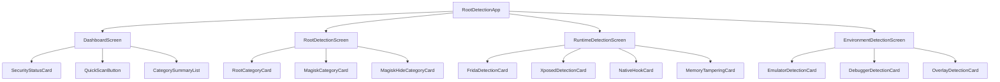
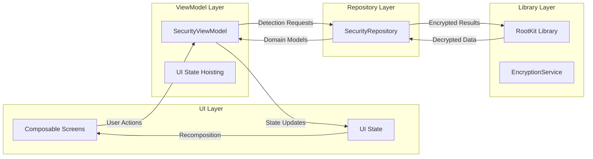
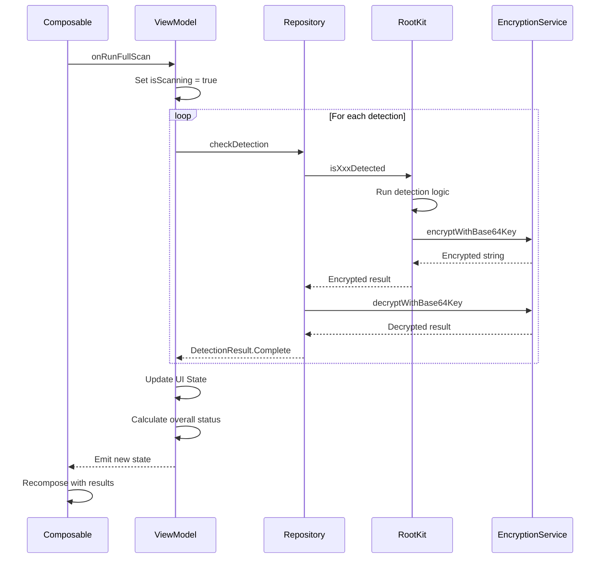

# UI Architecture Plan for Rootkit Library Demo App

## Executive Summary

This document outlines the UI architecture for an Android demo application that showcases the rootkit security library's detection capabilities. The design uses Jetpack Compose with Material 3 design principles, providing an intuitive interface for developers to test and visualize security detection results.

---

## 1. Screen Hierarchy and Navigation Structure

### 1.1 Navigation Architecture

The app uses a **bottom navigation** pattern with adaptive navigation suite for different screen sizes, leveraging the existing [`NavigationSuiteScaffold`](app/src/main/java/com/ssithara/rootdetection/MainActivity.kt:74) setup.

```
┌─────────────────────────────────────────────────────────────┐
│                    RootDetectionApp                         │
├─────────────────────────────────────────────────────────────┤
│  ┌─────────────────────────────────────────────────────┐   │
│  │                  Screen Content                       │   │
│  │                                                       │   │
│  │  [Dashboard] [Root] [Runtime] [Environment]          │   │
│  │                                                       │   │
│  └─────────────────────────────────────────────────────┘   │
├─────────────────────────────────────────────────────────────┤
│  ┌─────┐ ┌─────┐ ┌─────┐ ┌─────┐                          │
│  │Home │ │Root │ │Runtm│ │Env  │  Bottom Navigation       │
│  └─────┘ └─────┘ └─────┘ └─────┘                          │
└─────────────────────────────────────────────────────────────┘
```

### 1.2 Screen Hierarchy



### 1.3 Navigation Destinations

| Destination   | Icon                               | Label       | Description                       |
| ------------- | ---------------------------------- | ----------- | --------------------------------- |
| `DASHBOARD`   | `Icons.Default.Shield`             | Security    | Overall security status dashboard |
| `ROOT`        | `Icons.Default.AdminPanelSettings` | Root        | Root and Magisk detection         |
| `RUNTIME`     | `Icons.Default.BugReport`          | Runtime     | Runtime tampering detection       |
| `ENVIRONMENT` | `Icons.Default.Devices`            | Environment | Emulator and debugger detection   |

---

## 2. UI Component Specifications

### 2.1 Core Components

#### 2.1.1 SecurityStatusCard

A prominent card displaying the overall security status.

```kotlin
@Composable
fun SecurityStatusCard(
    status: SecurityStatus,
    lastScanTime: String?,
    onScanClick: () -> Unit,
    modifier: Modifier = Modifier
)

enum class SecurityStatus {
    SECURE,      // All detections passed - Green
    WARNING,     // Some detections found - Orange
    INSECURE,    // Critical detections found - Red
    SCANNING     // Scan in progress - Blue/Pulsing
}
```

**Visual Design:**

- Large circular status indicator with animated color
- Status text: "Device Secure" / "Threats Detected" / "Scanning..."
- Last scan timestamp
- "Run Full Scan" FAB or button

#### 2.1.2 DetectionCategoryCard

Reusable card for displaying a detection category summary.

```kotlin
@Composable
fun DetectionCategoryCard(
    title: String,
    icon: ImageVector,
    status: DetectionStatus,
    detectionCount: Int,
    totalChecks: Int,
    onClick: () -> Unit,
    modifier: Modifier = Modifier
)

data class DetectionStatus(
    val result: Result,
    val isScanning: Boolean = false,
    val lastChecked: Long? = null
)
```

**Visual Design:**

- Leading icon representing category
- Title and brief description
- Status indicator: checkmark for NOT_FOUND, warning for FOUND
- Progress indicator when scanning
- Click to navigate to detail screen

#### 2.1.3 DetectionResultItem

Individual detection result row.

```kotlin
@Composable
fun DetectionResultItem(
    name: String,
    description: String,
    result: Result,
    isExpanded: Boolean = false,
    details: Map<String, Boolean>? = null,
    onRunClick: (() -> Unit)? = null,
    modifier: Modifier = Modifier
)
```

**Visual Design:**

- Detection name with status icon
- Expandable to show sub-checks
- Individual run button optional
- Animated expand/collapse

#### 2.1.4 StatusIndicator

Visual status indicator component.

```kotlin
@Composable
fun StatusIndicator(
    result: Result,
    size: Dp = 24.dp,
    animated: Boolean = true,
    modifier: Modifier = Modifier
)
```

**Visual States:**

- `FOUND`: Red circle with warning icon or exclamation
- `NOT_FOUND`: Green circle with checkmark
- `SCANNING`: Blue pulsing circle with progress

### 2.2 Screen Components

#### 2.2.1 DashboardScreen

```kotlin
@Composable
fun DashboardScreen(
    securityState: SecurityState,
    onRunFullScan: () -> Unit,
    onNavigateToCategory: (DetectionCategory) -> Unit,
    modifier: Modifier = Modifier
)
```

**Layout Structure:**

```
┌────────────────────────────────────┐
│  ┌──────────────────────────────┐  │
│  │     SecurityStatusCard       │  │
│  │  [Large Status Indicator]    │  │
│  │  Device Secure               │  │
│  │  Last scanned: 2 min ago     │  │
│  │  [Run Full Scan]             │  │
│  └──────────────────────────────┘  │
│                                    │
│  Detection Categories              │
│  ┌──────────────────────────────┐  │
│  │ 🔐 Root Detection        ✓  │  │
│  │ 3/3 checks passed            │  │
│  └──────────────────────────────┘  │
│  ┌──────────────────────────────┐  │
│  │ 🐛 Runtime Tampering     ✓  │  │
│  │ 4/4 checks passed            │  │
│  └──────────────────────────────┘  │
│  ┌──────────────────────────────┐  │
│  │ 📱 Environment           ✓  │  │
│  │ 3/3 checks passed            │  │
│  └──────────────────────────────┘  │
└────────────────────────────────────┘
```

#### 2.2.2 RootDetectionScreen

```kotlin
@Composable
fun RootDetectionScreen(
    rootState: RootDetectionState,
    onRunAllChecks: () -> Unit,
    onRunIndividualCheck: (RootCheckType) -> Unit,
    modifier: Modifier = Modifier
)

enum class RootCheckType {
    ROOT_DETECTION,
    MAGISK_DETECTION,
    MAGISKHIDE_DETECTION
}
```

**Layout Structure:**

```
┌────────────────────────────────────┐
│  Root Detection                    │
│  [Run All Checks]                  │
│                                    │
│  ┌──────────────────────────────┐  │
│  │ ▼ Root Detection         ✓  │  │
│  │   General root access check   │  │
│  │   [Run]                       │  │
│  └──────────────────────────────┘  │
│  ┌──────────────────────────────┐  │
│  │ ▼ Magisk Detection       ✓  │  │
│  │   Magisk framework detection  │  │
│  │   [Run]                       │  │
│  └──────────────────────────────┘  │
│  ┌──────────────────────────────┐  │
│  │ ▼ MagiskHide Detection   ✓  │  │
│  │   MagiskHide stub detection   │  │
│  │   [Run]                       │  │
│  └──────────────────────────────┘  │
└────────────────────────────────────┘
```

#### 2.2.3 RuntimeDetectionScreen

```kotlin
@Composable
fun RuntimeDetectionScreen(
    runtimeState: RuntimeDetectionState,
    onRunAllChecks: () -> Unit,
    onRunIndividualCheck: (RuntimeCheckType) -> Unit,
    onExpandCheck: (RuntimeCheckType) -> Unit,
    modifier: Modifier = Modifier
)

enum class RuntimeCheckType {
    FRIDA,
    XPOSED,
    NATIVE_HOOK,
    MEMORY_TAMPERING
}
```

**Layout Structure:**

```
┌────────────────────────────────────┐
│  Runtime Tampering Detection       │
│  [Run All Checks]                  │
│                                    │
│  ┌──────────────────────────────┐  │
│  │ ▼ Frida Detection        ✓  │  │
│  │   Expanded view showing:      │  │
│  │   - frida-server process    ✓ │  │
│  │   - frida ports             ✓ │  │
│  │   - frida libraries         ✓ │  │
│  └──────────────────────────────┘  │
│  ┌──────────────────────────────┐  │
│  │ ▶ Xposed Detection       ✓  │  │
│  │   Xposed/LSPosed framework    │  │
│  └──────────────────────────────┘  │
│  ┌──────────────────────────────┐  │
│  │ ▶ Native Hook Detection  ✓  │  │
│  │   PLT/GOT hook detection      │  │
│  └──────────────────────────────┘  │
│  ┌──────────────────────────────┐  │
│  │ ▶ Memory Tampering       ✓  │  │
│  │   Memory modification checks  │  │
│  └──────────────────────────────┘  │
└────────────────────────────────────┘
```

#### 2.2.4 EnvironmentDetectionScreen

```kotlin
@Composable
fun EnvironmentDetectionScreen(
    environmentState: EnvironmentDetectionState,
    onRunAllChecks: () -> Unit,
    onRunIndividualCheck: (EnvironmentCheckType) -> Unit,
    modifier: Modifier = Modifier
)

enum class EnvironmentCheckType {
    EMULATOR,
    DEBUGGER,
    OVERLAY
}
```

---

## 3. State Management Approach

### 3.1 Architecture Overview

Using **MVVM with Unidirectional Data Flow (UDF)** pattern with Jetpack Compose.



### 3.2 State Models

#### 3.2.1 UI State Classes

```kotlin
// Main security state container
data class SecurityState(
    val overallStatus: SecurityStatus = SecurityStatus.SECURE,
    val isScanning: Boolean = false,
    val lastScanTimestamp: Long? = null,
    val rootState: RootDetectionState = RootDetectionState(),
    val runtimeState: RuntimeDetectionState = RuntimeDetectionState(),
    val environmentState: EnvironmentDetectionState = EnvironmentDetectionState()
)

// Root detection state
data class RootDetectionState(
    val isScanning: Boolean = false,
    val rootDetection: DetectionResult = DetectionResult.Idle,
    val magiskDetection: DetectionResult = DetectionResult.Idle,
    val magiskHideDetection: DetectionResult = DetectionResult.Idle
)

// Runtime detection state
data class RuntimeDetectionState(
    val isScanning: Boolean = false,
    val fridaDetection: DetectionResult = DetectionResult.Idle,
    val xposedDetection: DetectionResult = DetectionResult.Idle,
    val nativeHookDetection: DetectionResult = DetectionResult.Idle,
    val memoryTamperingDetection: DetectionResult = DetectionResult.Idle,
    val expandedCheck: RuntimeCheckType? = null
)

// Environment detection state
data class EnvironmentDetectionState(
    val isScanning: Boolean = false,
    val emulatorDetection: DetectionResult = DetectionResult.Idle,
    val debuggerDetection: DetectionResult = DetectionResult.Idle,
    val overlayDetection: DetectionResult = DetectionResult.Idle
)

// Individual detection result
sealed class DetectionResult {
    data object Idle : DetectionResult()
    data object Scanning : DetectionResult()
    data class Complete(
        val result: Result,
        val timestamp: Long = System.currentTimeMillis(),
        val details: Map<String, Boolean>? = null
    ) : DetectionResult()
}
```

### 3.3 ViewModel Design

```kotlin
@HiltViewModel
class SecurityViewModel @Inject constructor(
    private val securityRepository: SecurityRepository
) : ViewModel() {

    private val _uiState = MutableStateFlow(SecurityState())
    val uiState: StateFlow<SecurityState> = _uiState.asStateFlow()

    fun runFullScan() {
        viewModelScope.launch {
            _uiState.update { it.copy(isScanning = true, overallStatus = SecurityStatus.SCANNING) }

            combine(
                runRootDetections(),
                runRuntimeDetections(),
                runEnvironmentDetections()
            ) { root, runtime, env ->
                SecurityState(
                    rootState = root,
                    runtimeState = runtime,
                    environmentState = env,
                    lastScanTimestamp = System.currentTimeMillis()
                ).calculateOverallStatus()
            }.collect { state ->
                _uiState.value = state
            }
        }
    }

    fun runRootCheck(checkType: RootCheckType) { /* ... */ }
    fun runRuntimeCheck(checkType: RuntimeCheckType) { /* ... */ }
    fun runEnvironmentCheck(checkType: EnvironmentCheckType) { /* ... */ }
    fun toggleRuntimeCheckExpansion(checkType: RuntimeCheckType) { /* ... */ }
}
```

### 3.4 Repository Layer

```kotlin
class SecurityRepository @Inject constructor(
    private val rootKit: RootKit,
    private val encryptionService: EncryptionService
) {
    suspend fun checkRoot(): Result<DetectionResult.Complete> = withContext(Dispatchers.IO) {
        val encrypted = rootKit.isRootedDevice()
        val decrypted = encryptionService.decryptWithBase64Key(encrypted)
        Result.success(
            DetectionResult.Complete(
                result = Result.valueOf(decrypted)
            )
        )
    }

    suspend fun checkRuntimeTampering(): Result<RuntimeDetectionSummary> {
        // Uses getRuntimeTamperingSummary() for comprehensive results
    }

    suspend fun checkRuntimeDetails(): Result<Map<String, Map<String, Boolean>>> {
        // Uses getRuntimeTamperingDetails() for detailed sub-checks
    }

    // Additional check methods...
}
```

---

## 4. Data Flow from Library to UI

### 4.1 Data Flow Diagram



### 4.2 Library Method Mapping

| UI Detection    | RootKit Method                                                                              | Returns                           | Decryption                                 |
| --------------- | ------------------------------------------------------------------------------------------- | --------------------------------- | ------------------------------------------ |
| Root Detection  | [`isRootedDevice()`](rootkit/src/main/java/com/ssithara/rootkit/RootKit.kt:51)              | Encrypted String                  | `EncryptionService.decryptWithBase64Key()` |
| Debugger        | [`isDebuggerDetected()`](rootkit/src/main/java/com/ssithara/rootkit/RootKit.kt:67)          | Encrypted String                  | `EncryptionService.decryptWithBase64Key()` |
| Emulator        | [`isEmulatorDevice()`](rootkit/src/main/java/com/ssithara/rootkit/RootKit.kt:72)            | Encrypted String                  | `EncryptionService.decryptWithBase64Key()` |
| Runtime         | [`isRuntimeTamperingDetected()`](rootkit/src/main/java/com/ssithara/rootkit/RootKit.kt:81)  | Encrypted String                  | `EncryptionService.decryptWithBase64Key()` |
| Frida           | [`isFridaDetected()`](rootkit/src/main/java/com/ssithara/rootkit/RootKit.kt:89)             | Encrypted String                  | `EncryptionService.decryptWithBase64Key()` |
| Xposed          | [`isXposedDetected()`](rootkit/src/main/java/com/ssithara/rootkit/RootKit.kt:100)           | Encrypted String                  | `EncryptionService.decryptWithBase64Key()` |
| Memory          | [`isMemoryTamperingDetected()`](rootkit/src/main/java/com/ssithara/rootkit/RootKit.kt:111)  | Encrypted String                  | `EncryptionService.decryptWithBase64Key()` |
| Native Hook     | [`isNativeHookDetected()`](rootkit/src/main/java/com/ssithara/rootkit/RootKit.kt:122)       | Encrypted String                  | `EncryptionService.decryptWithBase64Key()` |
| Runtime Details | [`getRuntimeTamperingDetails()`](rootkit/src/main/java/com/ssithara/rootkit/RootKit.kt:133) | Map<String, Map<String, Boolean>> | No encryption                              |
| Runtime Summary | [`getRuntimeTamperingSummary()`](rootkit/src/main/java/com/ssithara/rootkit/RootKit.kt:140) | DetectionSummary                  | No encryption                              |

### 4.3 Result Processing Flow

```kotlin
// In Repository
private fun processDetectionResult(encryptedResult: String): Result {
    val decrypted = encryptionService.decryptWithBase64Key(encryptedResult)
    return when (decrypted) {
        Result.FOUND.name -> Result.FOUND
        Result.NOT_FOUND.name -> Result.NOT_FOUND
        else -> throw IllegalStateException("Unknown result: $decrypted")
    }
}
```

---

## 5. Compose Theme and Styling Guidelines

### 5.1 Color Scheme

Update the existing [`Color.kt`](app/src/main/java/com/ssithara/rootdetection/ui/theme/Color.kt) with security-focused colors:

```kotlin
// Security Status Colors
val SecureGreen = Color(0xFF4CAF50)
val SecureGreenLight = Color(0xFF81C784)
val WarningOrange = Color(0xFFFF9800)
val WarningOrangeLight = Color(0xFFFFB74D)
val InsecureRed = Color(0xFFF44336)
val InsecureRedLight = Color(0xFFE57373)
val ScanningBlue = Color(0xFF2196F3)
val ScanningBlueLight = Color(0xFF64B5F6)

// Background Colors
val BackgroundDark = Color(0xFF121212)
val SurfaceDark = Color(0xFF1E1E1E)
val SurfaceVariantDark = Color(0xFF2D2D2D)

// Category Colors
val RootCategoryColor = Color(0xFFE91E63)      // Pink
val RuntimeCategoryColor = Color(0xFF9C27B0)   // Purple
val EnvironmentCategoryColor = Color(0xFF00BCD4) // Cyan
```

### 5.2 Theme Configuration

```kotlin
// Dark Color Scheme for Security App
private val DarkColorScheme = darkColorScheme(
    primary = SecureGreen,
    onPrimary = Color.White,
    primaryContainer = SecureGreen.copy(alpha = 0.15f),
    secondary = RuntimeCategoryColor,
    tertiary = EnvironmentCategoryColor,
    error = InsecureRed,
    background = BackgroundDark,
    surface = SurfaceDark,
    surfaceVariant = SurfaceVariantDark
)

// Light Color Scheme
private val LightColorScheme = lightColorScheme(
    primary = SecureGreen,
    onPrimary = Color.White,
    primaryContainer = SecureGreenLight.copy(alpha = 0.3f),
    secondary = RuntimeCategoryColor,
    tertiary = EnvironmentCategoryColor,
    error = InsecureRed,
    background = Color(0xFFFAFAFA),
    surface = Color.White,
    surfaceVariant = Color(0xFFF5F5F5)
)
```

### 5.3 Typography

```kotlin
// Extend existing Typography
val SecurityTypography = Typography(
    displayLarge = TextStyle(
        fontSize = 32.sp,
        fontWeight = FontWeight.Bold,
        letterSpacing = (-0.5).sp
    ),
    headlineMedium = TextStyle(
        fontSize = 24.sp,
        fontWeight = FontWeight.SemiBold
    ),
    titleLarge = TextStyle(
        fontSize = 18.sp,
        fontWeight = FontWeight.Medium
    ),
    bodyLarge = TextStyle(
        fontSize = 16.sp,
        fontWeight = FontWeight.Normal
    ),
    labelLarge = TextStyle(
        fontSize = 14.sp,
        fontWeight = FontWeight.Medium
    )
)
```

### 5.4 Component Styling Guidelines

#### Cards

- Use `CardDefaults.elevatedCardElevation()` for category cards
- Rounded corners: 16.dp
- Padding: 16.dp horizontal, 12.dp vertical

#### Status Indicators

- Size: 24.dp for inline, 80.dp for main status
- Animated transitions between states
- Pulse animation for scanning state

#### Buttons

- FAB for primary scan action
- Text buttons for individual check runs
- Icon buttons for expand/collapse

---

## 6. Wireframe Descriptions

### 6.1 Dashboard Screen

```
┌─────────────────────────────────────────────────────────────────┐
│ ┌─────────────────────────────────────────────────────────────┐ │
│ │                      APP BAR                                │ │
│ │  Security Scanner                              [Settings]   │ │
│ └─────────────────────────────────────────────────────────────┘ │
│                                                                 │
│ ┌─────────────────────────────────────────────────────────────┐ │
│ │                                                             │ │
│ │                    ╭──────────────╮                        │ │
│ │                    │     🛡️       │                        │ │
│ │                    │    SECURE    │                        │ │
│ │                    ╰──────────────╯                        │ │
│ │                                                             │ │
│ │              Device Security Status                         │ │
│ │              All checks passed                             │ │
│ │                                                             │ │
│ │              Last scanned: Just now                        │ │
│ │                                                             │ │
│ │         ╭─────────────────────────────╮                   │ │
│ │         │    🔄  RUN FULL SCAN        │                   │ │
│ │         ╰─────────────────────────────╯                   │ │
│ │                                                             │ │
│ └─────────────────────────────────────────────────────────────┘ │
│                                                                 │
│              Detection Categories                               │
│                                                                 │
│ ┌─────────────────────────────────────────────────────────────┐ │
│ │  🔐  Root Detection                              ✓ PASS    │ │
│ │      Root, Magisk, MagiskHide checks                        │ │
│ │      ────────────────────────────────────                   │ │
│ │      3/3 checks passed                                     │ │
│ └─────────────────────────────────────────────────────────────┘ │
│                                                                 │
│ ┌─────────────────────────────────────────────────────────────┐ │
│ │  🐛  Runtime Tampering                           ✓ PASS    │ │
│ │      Frida, Xposed, Hooks, Memory checks                    │ │
│ │      ────────────────────────────────────                   │ │
│ │      4/4 checks passed                                     │ │
│ └─────────────────────────────────────────────────────────────┘ │
│                                                                 │
│ ┌─────────────────────────────────────────────────────────────┐ │
│ │  📱  Environment                                 ✓ PASS    │ │
│ │      Emulator, Debugger, Overlay checks                     │ │
│ │      ────────────────────────────────────                   │ │
│ │      3/3 checks passed                                     │ │
│ └─────────────────────────────────────────────────────────────┘ │
│                                                                 │
├─────────────────────────────────────────────────────────────────┤
│  [🏠 Security] [🔐 Root] [🐛 Runtime] [📱 Environment]         │
└─────────────────────────────────────────────────────────────────┘
```

### 6.2 Root Detection Screen

```
┌─────────────────────────────────────────────────────────────────┐
│ ┌─────────────────────────────────────────────────────────────┐ │
│ │  ← Back        Root Detection                              │ │
│ └─────────────────────────────────────────────────────────────┘ │
│                                                                 │
│         ╭─────────────────────────────────────╮               │
│         │     🔄 RUN ALL ROOT CHECKS          │               │
│         ╰─────────────────────────────────────╯               │
│                                                                 │
│ ┌─────────────────────────────────────────────────────────────┐ │
│ │  ▼ Root Detection                               ✓ PASS    │ │
│ │     ─────────────────────────────────────────────────────  │ │
│ │     Checks for root access via multiple methods            │ │
│ │     including su binary, root management apps, and         │ │
│ │     system properties.                                     │ │
│ │                                                             │ │
│ │     Last checked: 30 seconds ago                           │ │
│ │     ╭────────────────────────╮                             │ │
│ │     │  Run Check             │                             │ │
│ │     ╰────────────────────────╯                             │ │
│ └─────────────────────────────────────────────────────────────┘ │
│                                                                 │
│ ┌─────────────────────────────────────────────────────────────┐ │
│ │  ▶ Magisk Detection                             ✓ PASS    │ │
│ │     ─────────────────────────────────────────────────────  │ │
│ │     Detects Magisk framework installation and              │ │
│ │     related components.                                     │ │
│ │                                                             │ │
│ │     Last checked: 30 seconds ago                           │ │
│ │     ╭────────────────────────╮                             │ │
│ │     │  Run Check             │                             │ │
│ │     ╰────────────────────────╯                             │ │
│ └─────────────────────────────────────────────────────────────┘ │
│                                                                 │
│ ┌─────────────────────────────────────────────────────────────┐ │
│ │  ▶ MagiskHide Detection                         ✓ PASS    │ │
│ │     ─────────────────────────────────────────────────────  │ │
│ │     Detects MagiskHide through stub package                │ │
│ │     analysis.                                               │ │
│ │                                                             │ │
│ │     Last checked: 30 seconds ago                           │ │
│ │     ╭────────────────────────╮                             │ │
│ │     │  Run Check             │                             │ │
│ │     ╰────────────────────────╯                             │ │
│ └─────────────────────────────────────────────────────────────┘ │
│                                                                 │
├─────────────────────────────────────────────────────────────────┤
│  [🏠 Security] [🔐 Root] [🐛 Runtime] [📱 Environment]         │
└─────────────────────────────────────────────────────────────────┘
```

### 6.3 Runtime Detection Screen with Expanded Details

```
┌─────────────────────────────────────────────────────────────────┐
│ ┌─────────────────────────────────────────────────────────────┐ │
│ │  ← Back      Runtime Tampering                             │ │
│ └─────────────────────────────────────────────────────────────┘ │
│                                                                 │
│         ╭─────────────────────────────────────╮               │
│         │   🔄 RUN ALL RUNTIME CHECKS         │               │
│         ╰─────────────────────────────────────╯               │
│                                                                 │
│ ┌─────────────────────────────────────────────────────────────┐ │
│ │  ▼ Frida Detection                              ✓ PASS    │ │
│ │     ─────────────────────────────────────────────────────  │ │
│ │     Detects Frida instrumentation framework                 │ │
│ │                                                             │ │
│ │     Sub-checks:                                            │ │
│ │     ├─ frida-server process                     ✓         │ │
│ │     ├─ Frida default ports (27042, etc)         ✓         │ │
│ │     ├─ frida-agent.so library                   ✓         │ │
│ │     ├─ frida-gadget.so library                  ✓         │ │
│ │     └─ /data/local/tmp/frida files              ✓         │ │
│ │                                                             │ │
│ │     Last checked: 1 minute ago                             │ │
│ └─────────────────────────────────────────────────────────────┘ │
│                                                                 │
│ ┌─────────────────────────────────────────────────────────────┐ │
│ │  ▶ Xposed/LSPosed Detection                    ✓ PASS    │ │
│ │     ─────────────────────────────────────────────────────  │ │
│ │     Detects Xposed framework and variants                   │ │
│ └─────────────────────────────────────────────────────────────┘ │
│                                                                 │
│ ┌─────────────────────────────────────────────────────────────┐ │
│ │  ▶ Native Hook Detection                        ✓ PASS    │ │
│ │     ─────────────────────────────────────────────────────  │ │
│ │     PLT/GOT hook detection                                  │ │
│ └─────────────────────────────────────────────────────────────┘ │
│                                                                 │
│ ┌─────────────────────────────────────────────────────────────┐ │
│ │  ▶ Memory Tampering Detection                   ⚠ FOUND   │ │
│ │     ─────────────────────────────────────────────────────  │ │
│ │     Detects memory modifications                            │ │
│ └─────────────────────────────────────────────────────────────┘ │
│                                                                 │
├─────────────────────────────────────────────────────────────────┤
│  [🏠 Security] [🔐 Root] [🐛 Runtime] [📱 Environment]         │
└─────────────────────────────────────────────────────────────────┘
```

### 6.4 Environment Detection Screen

```
┌─────────────────────────────────────────────────────────────────┐
│ ┌─────────────────────────────────────────────────────────────┐ │
│ │  ← Back        Environment                                 │ │
│ └─────────────────────────────────────────────────────────────┘ │
│                                                                 │
│         ╭─────────────────────────────────────╮               │
│         │    🔄 RUN ALL ENV CHECKS            │               │
│         ╰─────────────────────────────────────╯               │
│                                                                 │
│ ┌─────────────────────────────────────────────────────────────┐ │
│ │  ▶ Emulator Detection                           ✓ PASS    │ │
│ │     ─────────────────────────────────────────────────────  │ │
│ │     Checks device hardware and system properties           │ │
│ │     to determine if running in an emulator.                │ │
│ └─────────────────────────────────────────────────────────────┘ │
│                                                                 │
│ ┌─────────────────────────────────────────────────────────────┐ │
│ │  ▶ Debugger Detection                           ✓ PASS    │ │
│ │     ─────────────────────────────────────────────────────  │ │
│ │     Detects if a debugger is attached to the app.          │ │
│ └─────────────────────────────────────────────────────────────┘ │
│                                                                 │
│ ┌─────────────────────────────────────────────────────────────┐ │
│ │  ▶ Overlay Detection                            ✓ PASS    │ │
│ │     ─────────────────────────────────────────────────────  │ │
│ │     Detects screen overlay attacks from malicious          │ │
│ │     apps. Requires Activity context.                        │ │
│ └─────────────────────────────────────────────────────────────┘ │
│                                                                 │
├─────────────────────────────────────────────────────────────────┤
│  [🏠 Security] [🔐 Root] [🐛 Runtime] [📱 Environment]         │
└─────────────────────────────────────────────────────────────────┘
```

---

## 7. Implementation Recommendations

### 7.1 File Structure

```
app/src/main/java/com/ssithara/rootdetection/
├── MainActivity.kt                    # Entry point
├── RootDetectionApp.kt               # Main composable
│
├── ui/
│   ├── theme/
│   │   ├── Theme.kt                  # Material 3 theme
│   │   ├── Color.kt                  # Color definitions
│   │   └── Type.kt                   # Typography
│   │
│   ├── components/
│   │   ├── SecurityStatusCard.kt     # Status display card
│   │   ├── DetectionCategoryCard.kt  # Category summary card
│   │   ├── DetectionResultItem.kt    # Individual result row
│   │   ├── StatusIndicator.kt        # Status icon component
│   │   └── ScanButton.kt             # Scan action button
│   │
│   ├── screens/
│   │   ├── DashboardScreen.kt        # Main dashboard
│   │   ├── RootDetectionScreen.kt    # Root detection UI
│   │   ├── RuntimeDetectionScreen.kt # Runtime detection UI
│   │   └── EnvironmentScreen.kt      # Environment detection UI
│   │
│   └── navigation/
│       ├── AppNavigation.kt          # Navigation setup
│       └── AppDestinations.kt        # Navigation destinations
│
├── viewmodel/
│   └── SecurityViewModel.kt          # Main state holder
│
├── repository/
│   └── SecurityRepository.kt         # Data layer
│
├── model/
│   ├── SecurityState.kt              # UI state models
│   └── DetectionResult.kt            # Result sealed class
│
└── service/
    └── EncryptionService.kt          # Existing decryption service
```

### 7.2 Dependency Additions

Add to [`app/build.gradle.kts`](app/build.gradle.kts):

```kotlin
dependencies {
    // Navigation Compose
    implementation("androidx.navigation:navigation-compose:2.7.6")

    // Lifecycle
    implementation("androidx.lifecycle:lifecycle-runtime-compose:2.6.2")
    implementation("androidx.lifecycle:lifecycle-viewmodel-compose:2.6.2")

    // Coroutines
    implementation("org.jetbrains.kotlinx:kotlinx-coroutines-android:1.7.3")

    // Hilt (optional - for DI)
    implementation("com.google.dagger:hilt-android:2.48")
    kapt("com.google.dagger:hilt-compiler:2.48")
    implementation("androidx.hilt:hilt-navigation-compose:1.1.0")
}
```

### 7.3 Implementation Priority

1. **Phase 1: Core Infrastructure**
   - State models and sealed classes
   - Repository layer with decryption
   - ViewModel with basic state management

2. **Phase 2: UI Components**
   - Status indicator component
   - Detection result item component
   - Category card component
   - Security status card component

3. **Phase 3: Screens**
   - Dashboard screen
   - Root detection screen
   - Runtime detection screen
   - Environment detection screen

4. **Phase 4: Polish**
   - Animations and transitions
   - Theme refinements
   - Error handling UI
   - Loading states

---

## 8. Summary

This architecture provides:

- **Clear separation of concerns** with MVVM pattern
- **Type-safe state management** with sealed classes and data classes
- **Reusable UI components** following Compose best practices
- **Intuitive navigation** with bottom navigation pattern
- **Security-focused theming** with appropriate color coding
- **Scalable structure** for adding new detection types

The design prioritizes developer experience, making it easy to:

- Run individual or all security checks
- View detailed results for each detection
- Understand the overall security posture at a glance
- Navigate between detection categories efficiently
